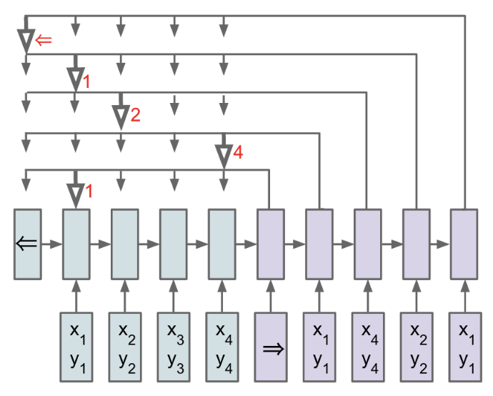
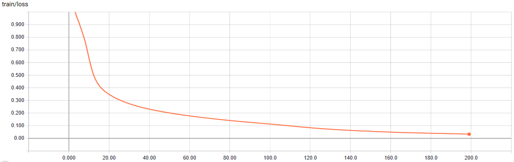

# Pointer network in PyTorch

This is an implementation of [Pointer Network](https://arxiv.org/abs/1506.03134) in PyTorch for [Convex Hull](https://en.wikibooks.org/wiki/Convexity/The_convex_hull) problem

## Network


## Environment
* Python 3.*
* Pytorch 0.3.*
* TensorboardX 1.1

## Data
Convex Hull data is aviailable at [link](https://drive.google.com/drive/folders/0B2fg8yPGn2TCMzBtS0o4Q2RJaEU)

## Usage
Training:

```bash
python convex_hull.py
```
Evaluating:

Not implemented yet

Visualization:
```bash
tensorboard --logdir LOG_DIR
```

## Results
* Training on Convex Hull 5

